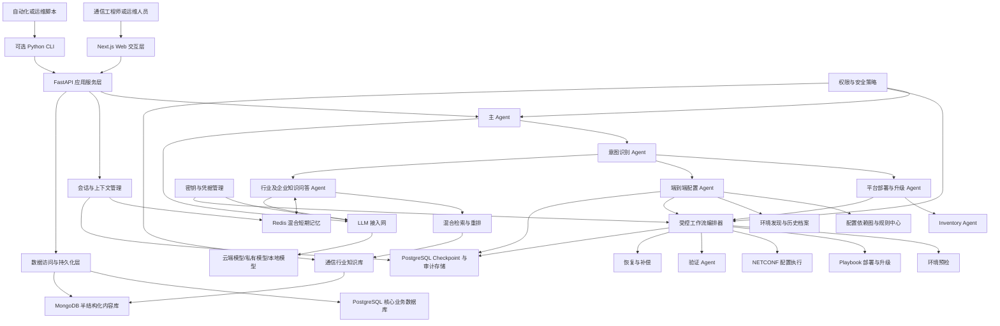
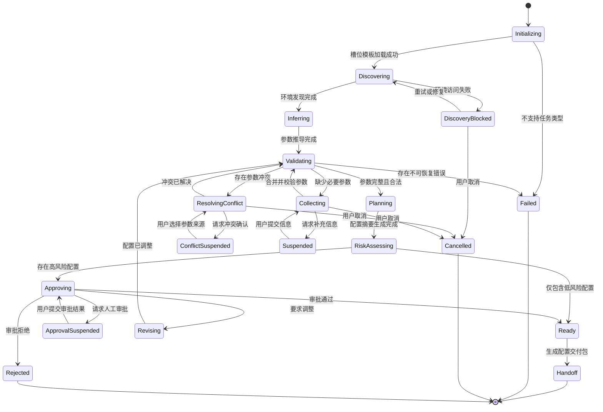
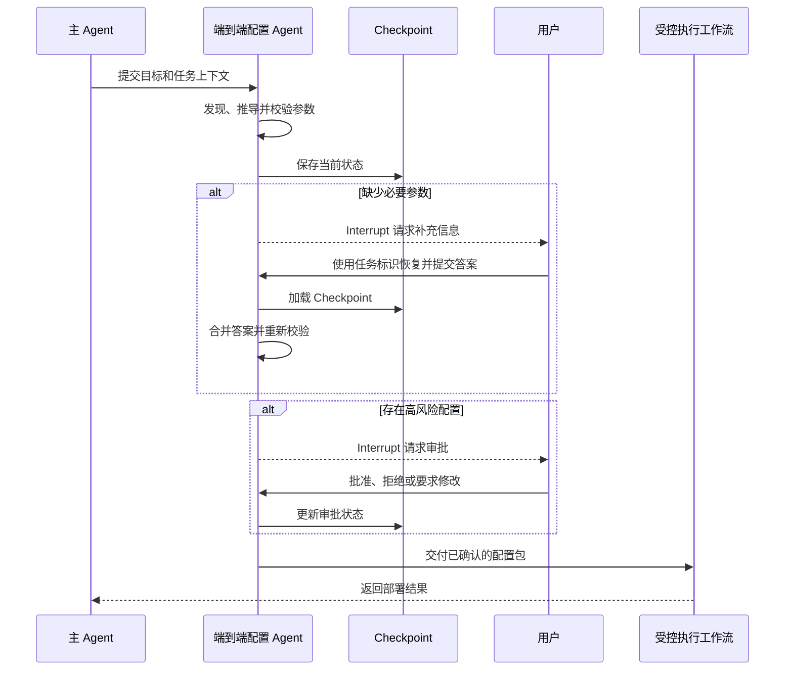
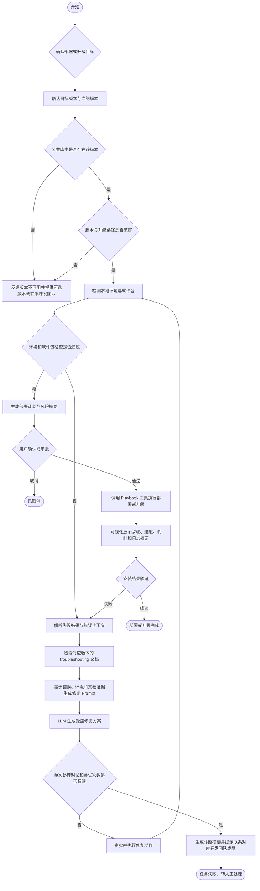
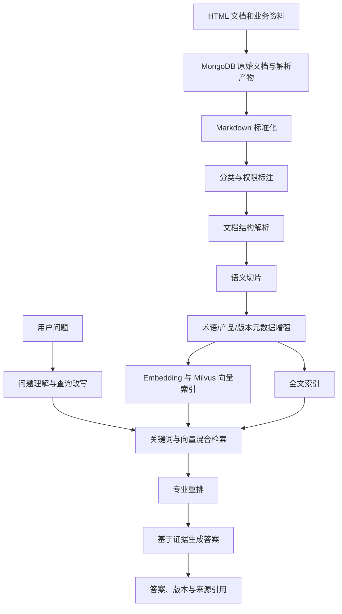
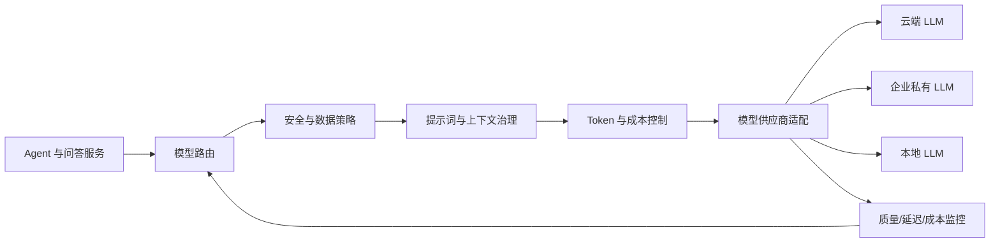

# Altiplano AI 助手技术架构设计方案

## 1. 项目简介

基于 LLM 构建接入网平台（Altiplano）AI 助手，以 Next.js Web 应用作为主要交互入口、FastAPI 作为统一后端服务，通过自然语言交互隐藏复杂的配置依赖，以最少的用户操作完成端到端配置；建设通信行业及企业知识库，提供专业、可信且来源可追溯的知识问答；对接 Playbook 工具，实现接入网平台的本地部署、升级、进度展示、结果验证与故障恢复。Python CLI 可作为可选的运维和自动化客户端复用同一套后端 API。

系统以配置依赖图和受控工作流为执行核心，以 LLM 为自然语言交互入口，以通信行业知识库为专业能力底座，形成具备确定性、专业性、可审计性和可恢复能力的平台工程工具。

## 2. 技术栈

Next.js｜TypeScript｜FastAPI｜Pydantic v2｜Python｜PostgreSQL｜SQLAlchemy 2.0｜Alembic｜psycopg 3｜MongoDB｜PyMongo Async API｜LangChain｜LangGraph｜RAG｜Milvus｜Redis｜NETCONF｜pnpm｜Turborepo｜uv

项目采用 Monorepo 管理前端、后端、共享 API 客户端和基础设施配置。Node.js 依赖由 pnpm workspace 管理，Python 依赖由 uv 管理，Turborepo 仅负责任务编排与缓存；前后端以 FastAPI 生成的 OpenAPI 契约为边界，TypeScript 客户端通过契约自动生成。

数据访问层采用以下技术选型：

| 能力 | 技术选型 | 使用约束 |
| --- | --- | --- |
| PostgreSQL ORM | SQLAlchemy 2.0 | 使用类型化声明模型和 `AsyncSession`，显式管理事务边界 |
| PostgreSQL 驱动 | psycopg 3 | 使用 SQLAlchemy 异步方言和连接池访问 PostgreSQL |
| Schema 迁移 | Alembic | 所有业务表结构变更通过版本化迁移管理 |
| API 数据模型 | Pydantic v2 | 定义 FastAPI 请求、响应和事件模型，不直接暴露 ORM 模型 |
| MongoDB 访问 | PyMongo Async API | 保存半结构化内容，第一阶段不额外引入 ODM |

PostgreSQL 作为核心业务事实库。SQLAlchemy 持久化模型、领域模型和 Pydantic API 模型应保持职责分离，通过应用服务或映射函数完成转换，避免数据库结构直接成为外部 API 契约。MongoDB 使用官方 PyMongo 异步 API 保存半结构化内容；仅在文档结构和查询逻辑显著复杂、确有统一模型约束需求时再评估引入 ODM。

## 3. 项目职责

1. 基于 LangChain 统一模型与工具调用，使用 LangGraph 编排 Altiplano 版本确认、部署与升级、进度展示、结果验证、故障恢复和人工兜底流程，降低平台部署与升级的操作复杂度。
2. 基于 Multi-Agent 架构，由主 Agent 调用 Intent Agent 完成意图识别，并将任务路由至知识问答 Agent、平台部署 Agent 或端到端配置 Agent。
3. 基于 RAG 架构建设通信行业及企业知识库，完成 HTML 文档的 Markdown 转换、结构解析、语义切片、元数据标注、Embedding 向量化和 Milvus 检索，实现专业问答与来源追溯。
4. 通过 Prompt 约束、引用校验、风险规则和证据不足拒答机制提升问答的准确性与可信度；接入问答评测机制，并将评测结果与用户反馈入库，为后续回溯和优化提供依据。
5. 基于 Redis 建设混合短期记忆，保存近期对话、会话摘要和结构化关键信息，采用 24 小时滑动过期机制，支持知识问答中的连续追问、上下文继承和用户纠正。
6. 通过 Human-in-the-loop 完成配置参数补充、冲突确认和风险审批；基于 Tool Calling 封装 Altiplano 平台操作工具，结合 NETCONF 实现配置下发、状态查询、参数校验和结果验证，以最少交互完成端到端配置。

## 4. 总体架构



## 5. 架构分层

### 5.1 Web 交互层与 API 层

Next.js Web 应用是用户的主要操作入口，负责：

- 接收自然语言目标。
- 提供向导式最小参数补全。
- 展示配置和部署计划摘要。
- 展示风险并完成关键操作确认。
- 通过 SSE 或 WebSocket 展示执行进度、诊断信息和结果摘要。
- 提供知识问答及引用来源。
- 支持继续当前问答会话及主动清除短期记忆。

FastAPI 是 Web、可选 CLI 和自动化脚本的统一后端入口，负责身份认证、权限校验、请求校验、会话管理、任务提交、Interrupt 恢复以及执行事件推送。交互端不直接操作基础设施，所有请求均通过 FastAPI 的应用服务和 Agent 层处理，避免展示逻辑与领域及部署逻辑耦合。

FastAPI 使用 Pydantic 定义请求、响应和事件模型，并发布 OpenAPI 文档。前端通过 OpenAPI 自动生成 TypeScript 类型和请求客户端，不手工维护重复的数据模型。普通请求使用 HTTP API，耗时任务通过任务标识异步跟踪，进度流优先使用 SSE；只有需要全双工实时交互的场景才使用 WebSocket。

建议提供三种交互模式：

| 模式 | 适用场景 | 交互特点 |
| --- | --- | --- |
| 快速模式 | 标准部署和常见配置 | 自动采用推荐值，仅确认关键风险 |
| 向导模式 | 首次使用或复杂环境 | 分阶段收集必要参数 |
| 专家模式 | 精细控制和故障排查 | 展示依赖、变更项和完整执行计划 |

Web 导航和 API 建议划分以下概念级能力域：

| 能力域 | 职责 |
| --- | --- |
| `deploy` | Altiplano 平台部署 |
| `upgrade` | Altiplano 平台升级 |
| `configure` | 平台及模块配置变更 |
| `inspect` | 环境、资源与运行状态检查 |
| `diagnose` | 故障诊断与原因分析 |
| `ask` | 通信行业知识问答 |
| `knowledge` | 知识库维护与更新 |
| `history` | 历史任务、状态和审计记录查询 |

以上能力域表示产品与 API 边界，不限定具体页面、路由或参数设计。

### 5.2 主 Agent 与任务路由层

主 Agent 负责理解用户整体目标、拆分任务并将子任务路由给专业 Agent，主要处理：

- Altiplano 本地部署与升级。
- 端到端配置及结果验证。
- 通信行业及企业知识问答。

环境检查、故障诊断、知识库维护和历史任务查询作为三条业务基线的支撑能力，由对应专业 Agent 或公共服务处理。

主 Agent 不直接执行配置和部署动作。对于包含多个目标的请求，主 Agent 将请求拆分为子任务，由工作流根据依赖关系进行排序或并行处理。

### 5.3 依赖图与规则中心

依赖图与规则中心用于将部署、升级和端到端配置目标转换为可验证的声明式目标，并表达：

- 配置项之间的前置关系。
- 环境资源和网络依赖。
- 产品与组件版本兼容关系。
- 安全、证书、域名和身份认证要求。
- 可串行或并行执行的任务关系。
- 部署、升级和配置操作的前置检查及验收标准。
- 失败后的补偿和回退关系。

规则分为三层：

1. 厂商基线规则：来自 Altiplano 官方文档和支持矩阵。
2. 企业策略规则：来自企业安全、网络和交付规范。
3. 项目覆盖规则：来自具体环境和项目的例外要求。

规则优先级为：项目覆盖规则 > 企业策略规则 > 厂商基线规则。

### 5.4 工作流编排层

工作流编排器负责将部署与升级、端到端配置两条执行型业务基线转换为可控制、可追踪的流程，并提供：

- 幂等执行。
- 断点恢复。
- 节点级状态持久化。
- 超时和重试策略。
- 人工确认和审批节点。
- 补偿动作及回退计划。
- 执行日志和审计记录。
- 部署、升级和配置结果自动验收。

方案生成与方案执行必须分离。默认先展示配置、变更和风险摘要，只有满足审批条件后才允许执行。

### 5.5 Altiplano 适配层

适配层负责隔离 Altiplano 不同版本、部署模式和基础设施的差异，能力边界包括：

- 平台安装、升级与生命周期管理。
- NETCONF 和平台北向接口访问。
- 网络、身份和证书配置。
- 状态查询和健康检查。
- 日志、指标、备份和恢复。

适配层向上提供稳定的领域操作，向下对接 Altiplano 官方支持的接口和部署工具。LLM 仅参与意图理解、参数抽取和解释，不直接生成并执行任意命令。

### 5.6 数据持久化层

数据持久化层按照一致性和访问模式划分存储职责：

- PostgreSQL 保存用户、权限、项目、环境、任务、执行步骤、配置版本、审批、审计、知识文档元数据和 LangGraph Checkpoint，是核心业务数据的事实来源。
- PostgreSQL 通过 SQLAlchemy 2.0 访问，使用 Alembic 管理 Schema 迁移，并由 psycopg 3 提供同步或异步驱动。ORM 模型不得直接作为 FastAPI 请求和响应模型。
- MongoDB 保存原始知识文档、解析产物、环境发现快照、诊断上下文以及较大的非固定结构工具结果，通过 PyMongo 异步 API 访问。
- Redis 保存可过期的问答短期记忆、缓存和临时事件状态，不承担长期业务事实存储。
- Milvus 保存可重建的文档 Chunk 向量及检索元数据，不承担文档权限和索引任务的主记录。

PostgreSQL 保存跨存储对象的业务标识、版本、权限、处理状态和完整性摘要。MongoDB 与 Milvus 的写入采用任务状态驱动的最终一致性和幂等重试，不使用跨数据库分布式事务；索引可根据 PostgreSQL 与 MongoDB 中的源数据重建。

## 6. Multi-Agent 协作设计

| Agent | 核心职责 | 主要输出 |
| --- | --- | --- |
| 主 Agent | 目标理解、任务拆分、路由和全局协调 | 子任务计划 |
| Intent Agent | 意图分类、实体及参数提取 | 标准化意图 |
| Inventory Agent | 资源、组件和环境状态识别 | 环境清单 |
| 平台部署与升级 Agent | 版本确认、环境预检、计划编排和故障恢复 | 部署或升级结果 |
| 端到端配置 Agent | 参数发现、推导、收集、校验和审批 | 配置交付包 |
| 验证 Agent | 执行部署、升级及配置结果校验 | 验证报告 |
| 行业及企业知识问答 Agent | 权限过滤、短期记忆管理、知识检索、重排和回答 | 连贯且带引用的专业答案 |

Agent 之间通过结构化状态和明确的输入输出契约协作，避免仅通过自然语言传递关键配置。

## 7. 端到端配置 Agent

### 7.1 定位与边界

端到端配置 Agent 位于主 Agent 与受控执行工作流之间，负责将用户目标转换为完整、合法且经过确认的结构化配置。

该 Agent 负责：

1. 根据任务类型加载参数槽位模板。
2. 从用户输入中提取参数。
3. 获取环境状态和历史配置。
4. 根据规则与依赖关系推导参数。
5. 检测参数缺失、冲突和非法值。
6. 合并当前阶段需要询问的最小问题集。
7. 通过 Interrupt 暂停任务并收集信息或审批结果。
8. 合并用户补充信息并重新校验。
9. 生成配置摘要和风险项。
10. 向受控执行工作流交付已确认的结构化配置。

该 Agent 不直接执行部署，不绕过审批修改生产环境，不将敏感凭据写入 LLM 上下文，也不单独依赖 LLM 判断配置合法性。

### 7.2 渐进式参数获取策略

参数获取按照以下优先级执行：

1. 解析用户当前输入。
2. 自动读取当前环境状态。
3. 读取用户、项目或环境配置档案。
4. 复用可信的历史部署记录。
5. 根据规则中心推导参数。
6. 使用低风险默认值。
7. 询问仍无法推导且会影响执行计划的参数。

典型交互流程如下：

```text
描述目标
  → 自动发现环境
  → 补充少量必要参数
    → 展示配置变更摘要与风险
  → 一次确认
  → 执行并自动验收
```

每轮询问应合并当前阶段所有可以确定的缺失项，避免发现一个参数便中断一次。低风险默认值集中展示，高风险变更单独确认。

### 7.3 参数槽位模型

| 槽位类型 | 示例 | 处理策略 |
| --- | --- | --- |
| 必填参数 | 目标环境、业务场景、目标对象 | 无法推导时中断询问 |
| 可推导参数 | 地址、接口参数、关联资源 | 根据环境和规则计算 |
| 可选参数 | 日志级别、非关键功能开关 | 使用低风险默认值 |
| 敏感参数 | 凭据、证书、访问令牌 | 仅保存密钥引用 |
| 高风险参数 | 数据覆盖、生产环境变更 | 生成计划后独立审批 |

每个参数槽位应包含参数值、数据类型、来源、可信度、依赖关系、校验状态、风险等级和确认状态。

### 7.4 状态机



状态转换由确定性规则控制，判断优先级为：

```text
参数冲突
→ 必填参数缺失
→ 参数合法性和依赖校验
→ 风险审批
→ 配置交付
```

### 7.5 中断事件

| 中断事件 | 触发条件 | 交互内容 |
| --- | --- | --- |
| `MISSING_INFORMATION` | 缺少无法推导的必要参数 | 缺失项、可选值、推荐值及影响 |
| `PARAMETER_CONFLICT` | 多个来源提供不同参数值 | 候选值、来源、建议和选择影响 |
| `RISK_APPROVAL` | 存在高风险或不可逆变更 | 影响范围、风险、回退条件和审批选项 |
| `DISCOVERY_FAILURE` | 无法自动获取必要环境信息 | 失败项、影响、重试和手工补充选项 |

### 7.6 Checkpoint 与 Interrupt

Checkpoint 负责保存工作流状态，Interrupt 负责在缺少信息或需要人工决策时暂停流程，两者共同实现渐进式信息收集。



设计约束如下：

- 触发 Interrupt 前必须持久化 Checkpoint。
- 同一任务使用稳定的任务或线程标识恢复。
- 恢复后必须重新校验用户补充的数据。
- 中断节点必须具备幂等性。
- 配置 Agent 完成前不得调用具有副作用的部署工具。
- Checkpoint 中的敏感参数只保存凭据引用，不保存明文。

### 7.7 配置交付契约

渐进式配置 Agent 最终输出结构化配置交付包，包含：

- 标准化用户目标。
- 最终配置参数及来源。
- 参数校验和确认状态。
- 目标环境信息。
- 配置依赖和执行顺序。
- 变更摘要与风险评估。
- 审批记录。
- 前置检查结果。
- 验收标准。
- 配置版本和完整性标识。

受控执行工作流只接受状态为 `Ready`、依赖校验通过且必要审批完成的配置交付包，并通过 NETCONF 或平台北向接口完成配置下发与结果验证。

## 8. Altiplano 部署与升级工作流



部署与升级工作流按以下阶段执行：

1. **操作与版本确认**：确认任务属于首次部署还是版本升级，识别目标版本和当前版本，并检查公共制品库、镜像库或版本清单中是否存在目标版本。升级任务还需校验版本兼容关系和受支持的升级路径；校验不通过时返回可选版本或处理建议。
2. **本地环境与软件包检测**：检查操作系统、CPU、内存、磁盘、网络、端口、运行时、依赖组件、权限以及软件包的存在性、版本和校验和。升级场景同时检查当前运行状态、配置兼容性和回退条件，未通过项进入诊断流程。
3. **计划生成与审批**：根据操作类型、目标版本、当前环境和依赖图生成执行计划、变更摘要、风险项及回退方案。完成必要确认或审批后，向 Playbook 工具提交结构化参数。
4. **Playbook 受控执行**：通过适配层对接 Playbook 工具执行部署或升级，不允许 LLM 直接拼接并执行任意命令。Playbook 的步骤状态、完成比例、当前任务、累计耗时和脱敏日志摘要由 FastAPI 以事件流输出，并在 Web 中实时可视化展示。
5. **结果验证**：执行完成后验证服务状态、接口连通性、组件版本、健康指标、配置完整性和基础业务能力。只有所有必要验收项通过，任务才标记为完成。
6. **失败诊断与自动修复**：执行或验收失败时，提取失败步骤、错误码、脱敏日志、环境快照和已执行动作，并按照操作类型及产品版本检索对应的 troubleshooting 文档。系统将检索证据与失败上下文组装为 Prompt 交给 LLM，生成结构化修复建议；修复动作仍需经过规则校验、风险判断和必要审批后，才能由受控工具执行。
7. **重试限制与人工兜底**：为自动修复设置可配置的单次处理时长和最大尝试次数，并记录每次尝试的方案、结果和耗时。达到任一上限后立即停止自动尝试，输出包含任务标识、目标版本、环境摘要、失败步骤、错误信息、已尝试方案和文档引用的诊断报告，并提示联系对应开发团队成员继续处理。

部署与升级流程采用“期望状态与当前状态对比”方式，仅执行必要变更。所有阶段均应支持 Checkpoint、幂等重试、失败恢复、升级回退和审计追踪；恢复任务时不得重复执行已成功且不可重复的步骤。


## 9. 通信行业及企业知识库

### 9.1 知识范围

| 知识域 | 主要内容 |
| --- | --- |
| 行业标准知识 | ITU-T、3GPP、ETSI、BBF、IETF 等规范 |
| 厂商产品知识 | Altiplano 产品文档、版本说明、操作手册和故障指南 |
| 企业私有知识 | 网络架构、交付规范、变更记录和故障案例 |
| 实时运行知识 | 平台状态、告警、配置快照和部署历史 |

不同知识域采用独立的访问权限、可信度等级和更新周期。

### 9.2 知识处理流程



### 9.3 回答约束

- 对标准编号、协议名、参数名和错误码优先使用关键词检索。
- 对语义问题使用向量检索，并结合产品、版本和网络域过滤。
- 答案必须包含适用范围、依据来源和不确定性说明。
- 存在资料冲突时明确展示冲突，不由 LLM 自行选择事实。
- 缺少有效证据时返回无法确认，不允许补全事实。
- 企业私有数据必须按照用户权限参与检索和回答。

### 9.4 混合短期记忆

知识问答采用 Redis 承载混合短期记忆，在当前会话中保留近期原始对话、会话摘要以及产品版本、设备类型、错误码、已确认条件和待解决事项等结构化关键信息，用于支持连续追问、减少背景信息重复输入并保持问题处理脉络。

短期记忆采用 24 小时滑动过期策略，用户每次继续当前会话时刷新有效期，连续 24 小时无交互后自动失效。用户应能够查看、纠正和主动清除当前会话记忆。

短期记忆仅用于补充问答上下文，不作为产品事实或专业结论的依据，不替代知识库检索、来源引用及权限校验。短期记忆与 LangGraph Checkpoint 相互独立：前者服务于问答连续性，后者服务于部署、升级和配置任务的状态恢复。

## 10. LLM 接入网



LLM 接入网提供：

- 多模型统一访问。
- 按任务类型动态路由。
- 故障降级与限流配额。
- 敏感信息识别和脱敏。
- Token、上下文和成本控制。
- 提示词模板版本管理。
- 结构化输出约束。
- 调用链追踪和质量评估。

推荐按任务分配模型能力：

| 任务 | 模型要求 |
| --- | --- |
| 意图识别 | 低延迟、低成本 |
| 参数提取 | 稳定的结构化输出能力 |
| 部署与升级方案解释 | 通用推理能力 |
| 通信专业问答 | 强推理能力与 RAG 支持 |
| 敏感文档处理 | 企业私有或本地模型 |

## 11. 状态与数据设计

| 数据类型 | 主要内容 | 主要存储 | 设计要求 |
| --- | --- | --- | --- |
| 配置状态 | 当前状态、期望状态、环境档案索引 | PostgreSQL | 强一致、可版本化 |
| 生命周期状态 | 当前版本、目标版本、执行阶段和回退点 | PostgreSQL | 可恢复、可审计 |
| Agent 状态 | 当前节点、槽位、冲突和风险 | PostgreSQL | 可恢复、可追踪 |
| 工作流状态 | 步骤、结果、恢复点 | PostgreSQL | 支持 LangGraph Checkpoint |
| 文档与快照内容 | 原始文档、解析产物、环境快照和诊断上下文 | MongoDB | 半结构化、带业务标识和版本 |
| 知识元数据 | 文档标识、权限、版本和索引状态 | PostgreSQL | 强一致、支持增量更新和权限隔离 |
| 知识向量 | 文档 Chunk Embedding 和检索元数据 | Milvus | 可重建、支持语义检索 |
| 问答短期记忆 | 近期对话、会话摘要和结构化关键信息 | Redis | 24 小时滑动过期 |
| 会话数据 | 用户上下文、任务上下文 | PostgreSQL | 与用户及会话范围绑定 |
| 审计数据 | 操作者、审批、变更和模型调用 | PostgreSQL | 防篡改、长期保留 |

Checkpoint 应持久化到 PostgreSQL，保存任务标识、当前状态、用户目标、参数槽位、参数来源、环境发现结果索引、依赖校验结果、风险项、审批状态、已完成步骤、错误信息和可恢复位置。较大的环境快照或工具原始结果保存到 MongoDB，Checkpoint 仅记录内容标识、版本和完整性摘要。

凭据、证书私钥和访问令牌不得进入普通配置、会话上下文、LLM 日志或知识库索引。

问答短期记忆不得保存凭据、证书私钥、访问令牌等敏感信息，也不得跨用户或跨权限域共享。用户权限变化后，历史上下文必须重新进行权限判断。

## 12. 安全与治理

系统应具备以下安全能力：

- 基于角色的访问控制。
- 环境级和操作级授权。
- 密钥和凭据集中管理。
- 敏感字段自动脱敏。
- LLM 输入输出安全检查。
- 高风险操作独立确认。
- 生产环境审批策略。
- 完整的部署、升级、配置和模型调用审计。
- 知识文档权限继承。
- 外部模型数据出境控制。
- 提示词注入和知识库污染防护。
- 部署包、规则和文档来源完整性校验。

操作风险分级如下：

| 风险等级 | 示例 | 控制方式 |
| --- | --- | --- |
| 低 | 查询状态、知识问答 | 自动执行 |
| 中 | 新增非关键配置 | 展示计划后确认 |
| 高 | 删除、覆盖、生产部署或升级 | 强确认、审批和回退检查 |

## 13. 核心设计原则

1. 确定性系统负责执行，LLM 负责理解、规划辅助和解释。
2. 所有部署、升级和配置动作必须来自可审计、可校验的工作流。
3. 配置依赖由规则和依赖图表达，不依赖模型记忆。
4. 用户目标、配置准备和底层部署实现相互解耦。
5. Agent 之间通过结构化契约传递关键状态。
6. 知识回答必须关联文档来源和适用版本。
7. 短期记忆只用于保持会话连续性，不得替代知识证据或固化未经确认的模型结论。
8. 默认采用最小权限和最少数据暴露原则。
9. 执行失败必须可诊断、可恢复、可验证。
10. 高风险自动化必须允许用户预览实际影响范围。
11. 任何用户补充信息在恢复工作流后都必须重新校验。

## 14. 建设阶段

### 14.1 第一阶段：可用原型

- 支持单一 Altiplano 版本和一种标准部署拓扑。
- 建立 Next.js Web 交互入口和 FastAPI 统一后端 API，可选提供复用 API 的 Python CLI。
- 建立 OpenAPI 契约生成流程和 TypeScript API 客户端，支持任务状态与进度事件展示。
- 建立 PostgreSQL 核心业务库和 MongoDB 半结构化内容库，完成迁移、索引、备份及恢复基线。
- 实现主 Agent、Intent Agent、平台部署 Agent、端到端配置 Agent 和知识问答 Agent。
- 支持环境发现、参数槽位、配置依赖图及基础 NETCONF 配置闭环。
- 支持部署计划预览、Checkpoint 和信息补充中断。
- 建立基础通信行业及企业文档 RAG 问答能力。
- 建立 Redis 混合短期记忆，支持连续追问、用户纠正、主动清除和 24 小时滑动过期。
- 建立任务状态和全过程审计。

### 14.2 第二阶段：生产化

- 支持多个环境、版本和部署拓扑。
- 支持受控升级、兼容性校验和失败回退。
- 完善工作流中断恢复、重试和补偿机制。
- 扩展端到端配置场景及自动验收能力。
- 集成企业身份、权限和审批系统。
- 完善混合检索、专业重排和引用评估。
- 建立模型路由、成本、质量和安全治理。
- 完善监控、告警和部署后自动验收。

### 14.3 第三阶段：智能运维

- 告警关联和根因分析。
- 配置漂移检测。
- 历史故障案例匹配。
- 网络影响范围分析。
- 部署风险评分。
- 基于运行数据的主动建议。
- 跨网元和跨协议的知识关联推理。

## 15. 方案总结

系统采用 Next.js 与 FastAPI 前后端分离、Monorepo 统一管理的工程形态，以 PostgreSQL 承载核心业务事实、MongoDB 承载半结构化内容、Redis 承载短期状态、Milvus 承载向量索引。通过 Multi-Agent、LangGraph 状态机、参数槽位、Interrupt、Checkpoint、RAG、Tool Calling、Playbook 和 NETCONF 等技术方案，形成 Altiplano 本地部署与升级、端到端配置、通信行业及企业知识问答三条业务基线。系统通过统一 API 契约、意图路由、混合短期记忆、结构化状态、风险审批、受控执行、自动验证和来源追溯，减少重复输入、人工查阅和失败重做成本，提升平台部署、升级、配置和运维效率。